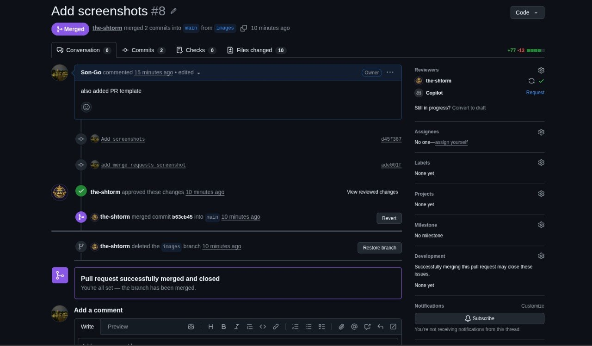

## About project

This is a GDE (Game Dev Evenings) Website project. Purpose of this project is to create website for Gamedev club in Innopolis University. Link to the **LICENSE**: https://github.com/Son-Go/SWP_team30/blob/0f53ff1e18ba968bdb1a47d9a93787e763ab1cef/LICENSE.

*Note*: Customer agreed on public repo.

---

### User stories

Link to the user stories: https://github.com/Son-Go/SWP_team30/blob/0f53ff1e18ba968bdb1a47d9a93787e763ab1cef/reports/week2/user-stories.md

---

### Interactive prototype

Link to the prototype: https://www.figma.com/proto/0Sz1FXBTcbhNLNBa4yhUKF/SWP_GDE_website?node-id=0-1&t=JELARNwYupqQAo5E-1

---

### MVP v0 report

Link to `reports/week2/mvp-v0-report.md`, the deployed MVP v0 or runnable artifact, run instructions, and public video demonstration: https://github.com/Son-Go/SWP_team30/blob/0f53ff1e18ba968bdb1a47d9a93787e763ab1cef/reports/week2/mvp-v0-report.md

---

### PR template and reviewed MRs

Link to the minimal PR/MR template and reviewed PRs/MRs created during Week 2: 

*Note*: following PR template was created after we already merge provided pull requests
- PR template: https://github.com/Son-Go/SWP_team30/blob/b63cb451631131f911318beffbd69ad7c92d2798/reports/PR-template.md
- Merge requests: https://github.com/Son-Go/SWP_team30/pulls?q=is%3Apr+is%3Aclosed

---

## Lychee configuration & latest protected-default-branch rum

Link to the Lychee configuration and latest successful protected-default-branch run: 

---

## Excluded lychee links

- "https://localhost"
- "http://localhost"

---

## Screenshots

### Protected default branch settings

### Example of reviewed PR

### Selected prototype and interface artifacts

### Deployed MVP v0

---
9. `Coverage` section that:

    * References the stable IDs covered by the prototype.
    * Explains the selected prototype and interface artifacts and references the stable user-story IDs represented by them.
    * Links to `reports/week2/mvp-v0-report.md`, which explains the MVP v0 foundation and documents the repeatable smoke-check scenario.
    * References stable user-story IDs represented by MVP v0 where applicable. For example, if MVP v0 sets up authentication infrastructure, reference the related user story (e.g., US-02: User login) even if login is not yet functional. MVP v0 is a product foundation and does not need to implement a complete user story.

## Customer meeting transcript

Link to the published customer transcript: https://github.com/Son-Go/SWP_team30/blob/0f53ff1e18ba968bdb1a47d9a93787e763ab1cef/reports/week2/customer-meeting-transcript.md

---

## Customer meeting summary

Link to the customer meeting summary: https://github.com/Son-Go/SWP_team30/blob/0f53ff1e18ba968bdb1a47d9a93787e763ab1cef/reports/week2/customer-meeting-summary.md

---

## Week 2 analysis

Link to the Week 2 analysis: https://github.com/Son-Go/SWP_team30/blob/0f53ff1e18ba968bdb1a47d9a93787e763ab1cef/reports/week2/analysis.md

---

## LLM usage

Link to the LLM report: https://github.com/Son-Go/SWP_team30/blob/0f53ff1e18ba968bdb1a47d9a93787e763ab1cef/reports/week2/llm-report.md

---